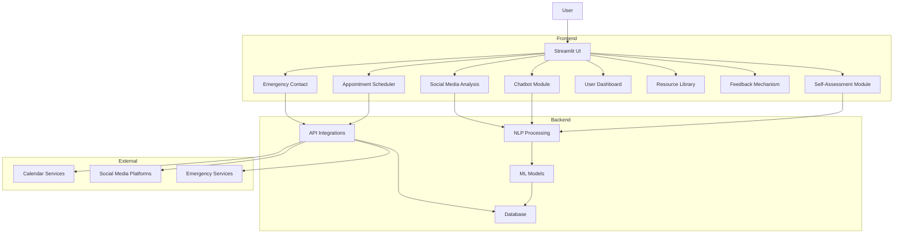

# System Patterns: AI-Powered Mental Health Support System

## System Architecture
The system follows a modular architecture with the following components:

1. **Frontend**: Built with Streamlit for interactive user interfaces
   - Provides intuitive UI components for all modules
   - Handles user interactions and form submissions
   - Renders visualizations and feedback

2. **Backend**: Python scripts implementing core logic
   - Processes user inputs
   - Integrates with NLP/ML models
   - Manages API connections
   - Handles data storage and retrieval

3. **Database**: Lightweight database (SQLite) or cloud solution (Firebase)
   - Stores user profiles and interaction history
   - Maintains resource library content
   - Securely saves assessment results and chat logs

4. **Deployment**: Cloud platforms (AWS, Azure, or Heroku)
   - Ensures scalability and availability
   - Provides secure access to the application

## Key Technical Decisions

1. **Streamlit for Frontend**
   - Chosen for rapid development of interactive data applications
   - Allows for easy integration of Python data science libraries
   - Provides built-in components for forms, charts, and media

2. **Python as Primary Language**
   - Extensive ecosystem for NLP and ML
   - Strong community support and libraries
   - Cross-platform compatibility

3. **Pre-trained NLP Models**
   - Leverage existing models (BERT, RoBERTa) for sentiment analysis
   - Fine-tune models for mental health-specific language processing
   - Balance accuracy with performance requirements

4. **Modular Design**
   - Independent modules with clear interfaces
   - Allows for parallel development and testing
   - Facilitates future extensions and improvements

## Design Patterns

1. **Model-View-Controller (MVC)**
   - Models: Data structures and database interactions
   - Views: Streamlit UI components
   - Controllers: Python scripts handling business logic

2. **Observer Pattern**
   - For notifications and alerts based on user activity
   - Allows modules to subscribe to relevant events

3. **Factory Pattern**
   - For creating appropriate NLP model instances
   - Simplifies model selection based on context

4. **Strategy Pattern**
   - For implementing different analysis algorithms
   - Allows for swapping algorithms without changing client code

## Component Relationships

The system is designed with clear separation of concerns, allowing each module to function independently while still maintaining cohesive integration through well-defined interfaces.
